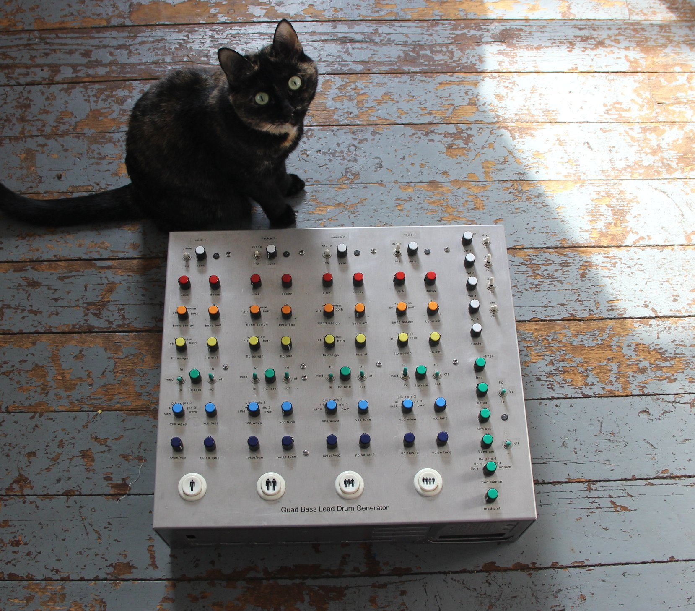

## 4 Voice Analog Drum Synthesizer

### [SCHEMATIC](https://github.com/JordanAceto/quad_bass_lead_drum_generator/blob/main/docs/fundrums_schematic.pdf)

### Features:
#### 4 independent drum voices
- SN76477 arcade sound generator as the heart of each voice
- wide range VCO with sine, triangle, fixed pulse, and PWM pulse waveforms
- digital swept noise for video-gamey explosions and harsh clanks
- LFO per voice
- transient generator per voice which can sweep the loudness, VCO pitch, and noise sweep

#### Rich IO
- each voice has
    - pad in: input jack for drum pads
    - logic in: input jack for trigger inputs
    - pedal: jack to connect a footswitch which shortens the decay time of the envelope, for closed/open hi-hat sounds and similar
    - cv in: control voltage input for the VCO and noise sweep

#### Voltage controlled filter
- single state variable type filter with lowpass, bandpass, and highpass available
- LFO and envelope modulation for the VCF
- each voice can be routed to the VCF or straight to the output
- external audio input
- external CV input

### Notes:
- this is an old project that I built on pad-per-hole prototyping board in the carcass of an old PC case. There is no PCB layout.
- I would probably do a few things differently today, but it does work well and sounds good.
- there are a few missing values, and some that I had to guess about, it's probably pretty close to right, but there are almost surely some errors in the schematic.
- note that the IC package numbers almost certainly do not perfectly match the physical instrument (ex. the circuits represented by opamps IC1A and IC1B in the schematic may or may not be in the same package in the as-built instrument)
- if for some reason you the reader are repairing or modifying this instrument, you'll need to hunt around for which circuit chunk goes with which parts on the physical  instrument. But there is a lot of duplication so once you get the hang of where something is for voice A, it will be in the same place for voice B, etc.
